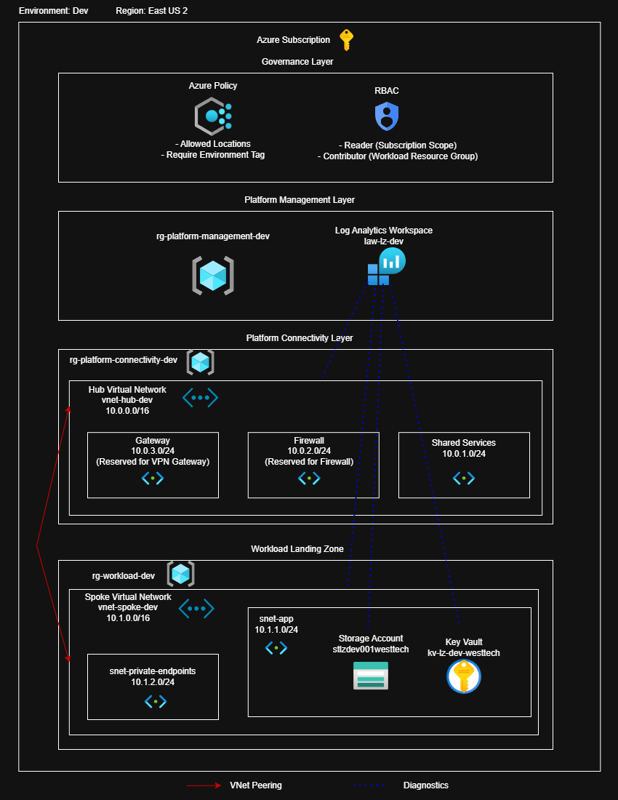

# Azure Enterprise Landing Zone with Terraform

## Overview

This project demonstrates the implementation of a production-style Azure landing zone using Terraform.

The environment includes a hub-and-spoke network topology, centralized logging, governance policies, role-based access control (RBAC), and a sample workload deployment.

The goal of the project is to showcase how Azure platform infrastructure can be deployed using Infrastructure as Code while enforcing security, governance, and network architecture best practices.

## Architecture

## Key Features

Hub-and-Spoke Networking

• Hub VNet for shared services
• Spoke VNet for workloads
• VNet peering between hub and spoke

Governance

• Azure Policy enforcement
• Allowed location restrictions
• Required environment tagging

Security

• Role-based access control (RBAC)
• Key Vault for secret storage

Observability

• Centralized Log Analytics workspace

Infrastructure as Code

• Terraform modular architecture
• Remote Terraform state in Azure Storage\

## Terraform Modules
modules/
  logging
  hub_network
  spoke_network
  network_peering
  policy_assignments
  role_assignments
  workload_landing_zone

## Documentation

Detailed documentation is available in the /docs directory:

• Architecture
• Deployment Guide
• Design Decisions
• Validation
